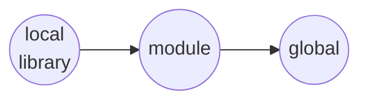
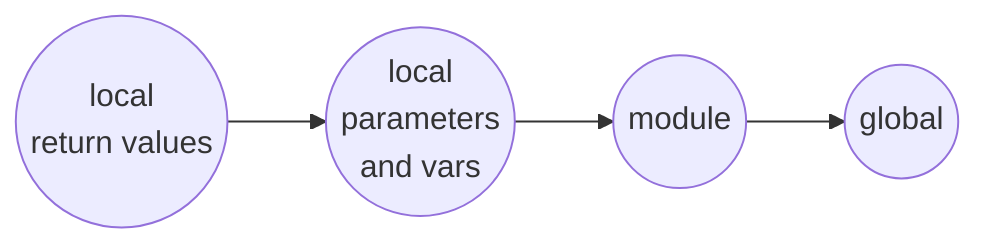
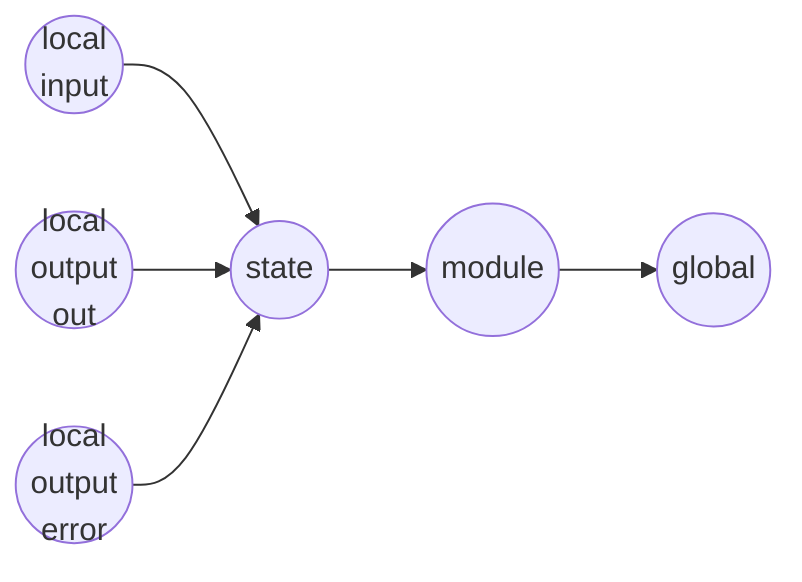
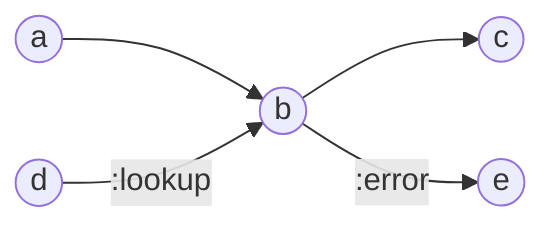

# Language characteristics

Tweakflow is a dynamically typed, domain-specific language for stream and batch processing. Typical applications include ETL for business intelligence, real time reporting on data streams, and data migrations.

Tweakflow is dynamically typed. It supports ad-hoc construction, nesting, and manipulation of data structures. This ability supports processing of unstructured data where structure is dynamically determined by the process, as well as data-driven processes in which data is self-describing or structure is provided at runtime through other means, like a metadata repository.

Data types can be explicitly declared, asserted, and converted, supporting use-cases that benefit from robustness through type safety.

Runtime errors can be caught and processed in a controlled way. Data records causing errors can be redirected to alternate processing paths.

Tweakflow supports embedded documentation as well as embedded structured meta-data.

Tweakflow supports three kinds of data processing entities: flows, steps and functions. Flows define and processing topology consisting of steps. Different types of flows pass records between steps using different processing semantics. A step describes a single conceptual operation within a flow. Steps read records from their inputs, and write records to their outputs. Functions are used as part of flow and step configuration to transform the data passing through them.

# Flows move records around
Tweakflow's primary means of processing data is through topologies of processing steps called flows. Tweakflow supports two types of flows. Data flows describe parallel processing of record streams. Control flows describe sequential processing of a single record. Each type of flow can return a result value upon finishing, much like a function.

## Data flows process streams of records
Data flows describe pipelines of steps in which records are read, processed, and passed on concurrently. Records are passed through a series of steps. All steps are running independently, and records are passed between operations using producer-consumer buffers.  

The data flow paradigm is designed for processing segments that operate on batches or streams of data.

## Control flows process one record at a time
Control flows describe sequential processing of a single record. They are useful for orchestration of tasks that must happen sequentially. Control flows are also useful when requirements mandate that each individual record must completely traverse a processing segment before another record can enter.

# Steps operate on records
Steps implement individual processing units in flows. There are two distinct kinds of steps: data steps and control steps. Data steps are used in data flows, and control steps are used in control flows. Steps implement most of actual data processing. Steps read, generate, write, transform, join, lookup, group or otherwise process records.

Tweakflow comes with a standard library of predefined steps, and users have the ability to define their own.

## Data steps are stream operations
Data steps are used in data flows. They can perform arbitrary processing on record streams they receive on their inputs, or generate themselves. Data steps have the ability to pull records from inputs and push records to outputs with no limitations on their row passing semantics. Data steps can therefore implement any operations possible on a dataset or datastream: map, join, reduce, group, sort, etc.

## Control steps are instructions
Control steps are used in control flows. Their row passing semantics dictate that they write exactly one output row for each input row they read, making them in effect perform a map operation. This limitation is mandated by the nature of control flows forming linear execution paths. A row traveling through a control flow can be thought of as an instruction pointer in a program. It is allowed to move from its current step to any connected step. The row cannot however disappear, which would be similar to the program just stopping mid-execution. Nor can it spawn another row, which would be similar to a new thread starting.

# Functions are pure
All functions in tweakflow are pure. This means a tweakflow function, given the same arguments, will always return the same result. Non-pure operations like getting the system time, generating a random number, or file I/O are provided through result variables exposed by steps.

# Data is immutable
Tweakflow represents all data as immutable values. There are pre-defined primitive data types for strings, numbers, booleans, etc. Additionally there are container types for maps and lists, which allows for JSON-like nested structures.

# Modules structure solutions
A project consists of one ore more organizational units called modules. Each module is represented by a file. A module defines a combination of zero or more libraries, steps, and flows.

A module file must be encoded in UTF-8 and have the file extension `tf`.

A module has the following formal structure.

```
module
  : endOfStatement* moduleHead moduleComponent* EOF
  ;

moduleHead
  : metaDef nameDec? importDef* aliasDef* exportDef*
  ;

moduleComponent
  : library           
  | dataStep
  | controlStep       
  | dataFlow          
  | controlFlow       
  | endOfStatement    
  ;
```

## Imports bring other modules into scope
Import statements bring entities exported from other modules into the current module. The syntax allows importing individual entities, or all entities into current scope. If imported individually, entities may be bound to local names that are different from the names in the source module.

It is an error to import an entity that is not explicitly exported in its source module.

Imported names are placed in module scope. Names in module scope can be unambiguously referenced using the `::` prefix.

TODO: load path and dot relative paths and extensions vs. just names

**Syntax**

```text
importDef
  : 'import' importMember+ 'from' modulePath endOfStatement?
  ;

importMember
  : moduleImport
  | componentImport
  ;

moduleImport
  : '*' 'as' importModuleName ','?
  ;

componentImport
  : exportComponentName ('as' importComponentName)? ','?
  ;
```

**Examples**

Module `"./util/strings.tf"` is imported as a whole below. Any exported name `x` is available as `strings.x` locally.

```javascript
import * as strings from "./util/strings.tf"
```

Specific entities are imported individually below. The import statement references two libraries from module `"./util/strings.tf"`, making them available under new names `str` and `conv`.

```javascript
import string_lib as str, conversion_lib as conv from "./util/strings.tf"
```

## Named modules
Modules can declare themselves visible under a specific unique name in global scope. It is an error to load two modules both claiming the same name.

Named modules are designed to facilitate project-wide configuration environments and global libraries of which there must be exactly one in scope. The idea is that individual modules remain in control of their functional dependencies through imports, while their configuration dependencies are controlled from the outside.  

Modules are only loaded if they are imported by other modules or included on the command line. Switching between configuration environments is accomplished by passing the different configuration modules on the command line.

**Example**

```javascript
/* file environments/local.tf */
module env

export library conf {
  string data_path: "/home/me/my_project/data/"
  ...
}

/* file environments/production.tf */
module env

export library conf {
  string data_path: "/var/incoming/data/"
  ...
}

/* file main.tf referncing the active env module */
library my_lib {
  file_location: (string iso_date) -> $env.conf.data_path .. iso_date .. "_data.csv"
}

```

TODO: more complete examples how to use two different environments from the command line

## The standard library is a named module

The tweakflow runtime always loads the standard library module named `std`.

```javascript
library my_util {
  foocat: (x, y) -> $std.strings.concat([x, y])
}
```

## Aliases create convenient local names

Tweakflow allows local aliases to shorten names, and allow convenient swapping of libraries.

```javascript
/* s can be used as shortcut to $std.strings */
alias $std.strings as s

/* potentially swap out s with another implementation */
/* import awesome_strings as s from "./awesome_strings_lib.tf" */

library my_util {
  /* s alias used here */
  foocat: (x, y) -> s.concat([x, y])
}
```

## Exports make parts of a module public

A module defines its public interface using exports. Items can be exported inline when defined, or explicitly in an export statement. An export statement refers to a name and makes it available for other modules to import, potentially under a new name. Re-exporting an imported name is allowed.

```text
exportDef
  : 'export' reference ('as' exportName)? endOfStatement?
  ;

exportName
  : IDENTIFIER
  ;
```

Below example exports the strings standard library under the name `strings`, and a local library `common` under the name `util` .

```javascript
/* file lib.tf */
export $std.strings as strings
export common as util

library common {
  ...
}

/* file main.tf */
import util, strings from "./lib.tf"
```

# Docs and metadata are annotations

Modules and all named entities like flows, steps, libraries, and variables support optional documentation annotations and metadata. Documentation annotations and metadata are values that language processing tools can extract for the purpose of generating project documentation. Tweakflow does not impose any restrictions on these expressions, not even on their types. The doc and meta expressions can only consist of literals.

Below is an example of a library with metadata and a docstring.

```javascript
library lib

  meta {
    :version "1.0.0"
  }

  doc "lib doc string"

{
  /* library variables */
  ...
}  
```

# Runtime implementation notation
In cases where an implementation of a step or function is provided by the runtime, the  declaration includes a `via` expression. The `via` expression is typically a dict literal containing runtime-specific keys. Its purpose is to inform the runtime which feature is being declared, and how to go about executing it. It is therefore similar to a `native` or `builtin` declaration in other languages.

**Example for runtime-implemented function**

```javascript
export library strings {
  function concat: (list xs) -> string via {:impl "runtime-specific information"}
}
```

# Libraries are collections of values

A tweakflow library is a named collection of variables. The variables typically hold functions, but they can hold any data type. Since library contents do not change, all library variables are implicitly declared constant. Libraries can be marked as exports as part of their definition, in which case they are exported using their given name.

**Syntax**

```text
library
  : 'export'? 'library' identifier metaDef '{' varDef* '}'
  ;

varDef
  : dataType? identifier metaDef ':' expression endOfStatement?
  ;
```

**Examples**

Below is an exported library holding functions implemented via runtime.

```javascript
export library data {
  function get_in: (x, list keys) -> via {...}
  function concat: (list lists) -> via {...}
  function merge: (list maps) -> via {...}
}
```

Below is a private library that holds constants `a`, `b` and function `f`.

```javascript
library lib {
  a: 1
  b: 2
  f: (x) -> x
}  
```

# Variables are named values
A variable is a named entity that holds a value. If the value of a variable cannot change during the lifetime of its scope, it is called a constant. Depending on the scope in which a variable is declared, constness may be either implied or optional. The documentation of each scope in which variables are declared states the effects of declaring a variable as constant.

## Variable declarations assert existence
Variable declarations are assertions that a variable exists, but they do not specify any values. This is commonly needed in cases where values are provided by the runtime. Most notably values for variables exposed by steps.

Variable declarations consist of an optional `const` modifier, an optional data type, and a name identifier. If the data type is omitted the `any` type is used, indicating that any data type is acceptable. If a data type is declared, the provider of the value is responsible for ensuring that variable values match the declared type.

**Syntax**

```text
varDec
  : 'const'? dataType? identifier metaDef endOfStatement?
  ;
```

## Variable definitions specify values
Variable definitions specify the value of the variable as an expression that evaluates in the variable's scope.

Each variable has a data type. If no data type is specified, the `any` type is used, indicating that a value of any type is acceptable. Variables specifying a type have their values implicitly [cast](#type-casts) to the declared data type.

```text
varDef
  : 'const'? dataType? identifier metaDef ':' expression endOfStatement?
  ;
```

# Data types
All data types are immutable. Any manipulation of a value generates a new value. This simplifies equality comparisons, and prevents race conditions and bugs that would otherwise arise from steps holding on to instances of records that are then manipulated downstream.

## Boolean
The `boolean` type holds the values `true` and `false`.

## String
The `string` type holds text information. Strings are immutable. Whenever tweakflow expects a string, it is legal to supply a symbol instead. Tweakflow converts the symbol to a string automatically. Strings are most commonly notated as constant [literals](#string-literals), or as part of [string interpolation](#string-interpolation).

## Long
The `long` type holds 64-bit signed integers. Integers are notated using [integer literals](#integer-literals).

## Double
The `double` type holds 64-bit double-precision IEEE 754 floating point numbers. Literal floating point numbers are notated using [floating point number literals](#floating-point-number-literals).

## Dict
The `dict` type is an associative dictionary structure where string keys are mapped to arbitrary values. Symbols can be used interchangably with strings for keys as a notational convenience.

Maps can be written using [map literals](#map-literals).

## List
The `list` type holds a finite sequence of values in a defined order. It is equivalent to array types in other languages.

Lists can be written using [list literals](#list-literals).

## Function
The `function` type holds callable functions. Functions with different arguments and return types share the same type. There are no distinct types for different function signatures.

Functions are defined using [function literals](#function-literals).

## Any
The `any` type is not a concrete type of its own, but a type designation that indicates the possibility of any concrete type to be present.


# Expressions
Expressions evaluate to values. Tweakflow uses strict evaluation. All variable expressions are guaranteed to evaluate at the time their scope evaluates. Output variables always evaluate when a row is passing through an output, for example, regardless of whether said variable is used.

## Nil
The `nil` value represents the absence of information. It is equivalent to `NULL` in SQL databases and `null`, `nil`, `None` or `Nothing` in many programming languages. The `nil` value is a valid value for any data type.

## String interpolation
Strings are often constructed from constant pieces and variable contents. String interpolation is used to facilitate such string construction in a compact way.

TODO: implement and document

## Dict literals
Maps are notated as a sequence of key value pairs inside curly braces. Commas separating entries are optional. The key element is an expression that is cast to a string implicitly. The empty dict is notated as `{}`.

A splat expression can be used to merge maps left to right as it desugars to calls to `$std.data.merge`.
For example `{:a "a", ...s}` desugars to `$std.data.merge([{:a "a"} s])`

```text
mapLiteral
   : '{' (((key expression)|(splat)) ','? )*  '}'
   ;

splat
  : '...' expression
  ;     
```

Examples of equivalent maps:

```javascript
{
  :year 1887
  :title "A Study in Scarlet"
  :author "Sir Arthur Conan Doyle"
}

{
  "year" 1887,
  "title" "A Study in Scarlet",
  "author" "Sir Arthur Conan Doyle"
}

{
  :year 1887
  :title "replaced"
  ...{:title "A Study in Scarlet", :author "Sir Arthur Conan Doyle"}
}
```


## List literals
Lists are notated as a sequence of values inside square brackets. Commas separating entries are optional. The empty list is notated as `[]`.

A splat expression can be used to concatenate lists left to right. The splat desugars to calls to `$std.data.concat`.
For example `["a", ...s]` desugars to `$std.data.concat([["a"], s])`.


```text
listLiteral
  : '[' ((expression|splat) ','? )*  ']'
  ;
splat
  : '...' expression
  ;    
```

Examples of equivalent lists:

```javascript
[1 2 3]
[1, 2, 3]
[1 ...[2 3]]
```

## Functions

Functions are notated as a parameter list followed by an optional return type and a return expression.

The return expression may be replaced with a `via` declaration signifying that the implementation is provided by the runtime. This is equivalent to a `native` or `builtin` declaration in other languages.

```text
functionLiteral
  : functionHead (expression|viaDec)
  ;

functionHead
  : '(' paramsList ')' '->' dataType?
  ;

paramsList
  : (paramDef ','?) *
  ;

paramDef
  : dataType? identifier ('=' expression)?
  ;

viaDec
  : 'via' expression
  ;  
```

If the data type of a parameter is not specified, `any` is used. Parameters can declare default values. Default values are supplied for missing arguments in a function call. Default values can only consist of literals. If no default value is specified `null` is used.

If the return data type is not spacified, `any` is used. If both a return data type and a return expression are specified, the return value is implicitly cast to the return data type. If a function is implemented by the runtime, the implementation must ensure the return type matches the declaration.

Examples of functions:

```javascript
/* a constant function returning true */
() -> true      

/* a function returning its argument incremented by 1 */
(long x) -> x+1

/* a function returning the integer with the smallest magnitude */
(long x, long y) -> long
  if math.abs(x) < math.abs(y)
    x
  else
    y

/*
  A function combining two input strings to a single output string in some way.
  Implemented via runtime.
*/
(string a, string b) -> string via {...}
```

## Function calls

Function calls are notated as round brackets following an expression that evaluates to a function. For the purposes of illustration, the following function should be known as `f`.

```javascript
f: (long id = 0, string name = "n/a") -> id .. "-" .. name
```

Functions give their parameters names and list them in sequence. Above function has parameters `id` of type long and `name` of type string. Both have default values. Unless a parameter type has the `any` type, arguments given in function calls are automatically cast to the declared parameter type.

When calling a function it is possible to specify parameter values using position, name, or a mix of both.

### Positional arguments

Arguments given by position just list the values in parameter order and are seperated by comma. The following call passes `42` as `id` and `"test"` as `name`.

```javascript
f(42, "test")
```

Passing more than the declared number of positional arguments is an error. Passing less than the declared number of positional arguments results in the missing arguments being supplied through default values of the missing parameters.

### Named arguments

Arguments given by name are listed in pairs of names and values. They are separated by commas. The following call passes `42` as `id` and `"test"`  as `name` again, but uses named arguments this time. The order of named arguments does not matter.

```javascript
f(:id 42, :name "test")
```

Named arguments can be supplied via a splat expression. This offers a notational convenience for cases where all arguments have been collected into a dict. Below example supplies the same `id` and `name` arguments again. This time using a dict, instead of specifying each parameter individually.

```ja
person: {
	:id 42
	:name "test"
}
result: f(...person)
```

Named arguments can be interspersed with splats. The resulting arguments dict is then merged left to right, with rightmost keys taking precedence in case of duplicates. Below example again effectively passes `42` as `id` and `"test"` as name.  

```javascript
p: {
  :id 0
  :name "test"
}
result: f(...p, :id 42)
```

Passing undeclared named arguments to a function is an error. Omitting arguments results in the missing arguments being supplied through default values of the missing parameters.

### Mixed positional and named arguments

Position and named arguments can be mixed in a single call. Positional arguments are listed first. The following call passes `42` as `id` and `"test"`  as `name`. It mixes positional and named arguments.

```javascript
f(42, :name "test")
```

Mixed style arguments are a useful idiom when a function exposes a set of leading arguments that have intuitive order, but allows for a set of less common option-style parameters to configure details.

## Container access

Lists, dict, and string contents are accessed using square brackets.

Lists are indexed with 0-based long values. Indexes supplied for a list are automatically cast to long values.  If the given index does not exist in the list, the value of the access expression is `nil`.

```javascript
library data {
  list items: ["a" "b" "c"]
  ...
  item_0: items[0]        /* "a" */
  item_1: items[1]        /* "b" */
  item_2: items[2]        /* "c" */
  item_missing: items[-1] /* nil */  
}
```

Maps are indexed with strings. All values given as keys are automatically cast to strings. Symbols are also converted to strings automatically. If a given key does not exist, the value of the access expression is `nil`.

```javascript
library data {
  map bag: {
    :a "a"
    :b "b"
    :c "c"
  }
  ...
  bag_a: bag[:a]   /* "a"  */
  bag_b: bag[:b]   /* "b"  */
  bag_c: bag["c"]  /* "c" */
  bag_missing: bag[:missing]  /* nil */
}
```

Strings are indexed with 0-based long values to access individual characters. All values given as keys are automatically cast to longs. If a given index does not exist, the value of the access expression is `nil`.

```javascript
library data {
  string greeting: "hello"
  ...
  hello_0: greeting[0]   /* "h"  */
  hello_1: greeting[1]   /* "e" */
  hello_x: greeting[10]  /* nil */
}
```

If the container that the access is peformed on is not a dict, list, or string, or if the container is `nil`, the access value is `nil`.

```javascript
library data {
  map missing: nil
  item: missing[:a] /* nil */
  long non_container: 1
  access: non_container[0] /* nil */
}
```

If a given key is `nil`, the access value is null.

```javascript
library data {
  ...
  item_n: bag[nil]   /* nil */
  item_m: items[nil] /* nill */
}
```

Container access expressions can be chained to access nested data.

```javascript
library data {
  map story: {
    :name "A Study in Scarlet"
    :adaptations [
      {:year 1914 :media "silent film"}
      {:year 1968 :media "television series"}
	  ...
    ]
  }
  item: story[:adaptations][0] /* {:year 1914 :media "silent film"} */
}
```

The chained keys can be placed inside a single set of square brackets.

```javascript
story[:adaptations][0] /* {:year 1914 :media "silent film"} */
story[:adaptations 0]  /* {:year 1914 :media "silent film"} */
```

The list of keys can be interspersed with splat expressions. The splat expression must be a list containing the keys to access. Each splat expression is expanded, and concatenated with any existing items just as in [list literals](#list-literals).

```javascript
library data {
  ...
  list path: [:adaptations 0]
  item: story[...path] /* {:year 1914 :media "silent film"} */
}
```

TODO: how to distinguish between an index not existing and an index having a null value via something like `$std.data.key_exists?(container, [:foo :bar :baz 0 :goo])`

## Conditionals

### The if conditional

The standard conditional consists of the `if` keyword, a condition, an optional `then` keyword followed by a  then_expression, the optional `else` keyword, and an else_expression. The whole conditional is an expression, and evaluates to either the then_expression, or the else_expression.

```text
'if' condition 'then'? then_expression 'else'? else_expression
```

The conditional evaluates the condition and casts it to a boolean value. If the condition evaluates to true, the then_expression is evaluated and becomes the value of the conditional. If the condition evaluates to false, the else_expression is evaluated and becomes the value of the conditional.

**Example**

```javascript
library data {
  function nvl: (x, value_if_null) ->
    if x == null
	  value_if_null
    else
      x
}
```

### Ternary expression conditional

The c-style ternary expression syntax is also supported. This syntax emphasizes compactness.

```text
condition '?' then_expression ':' else_expression
```

**Example**

```javascript
library data {
  function num_flags: (x) -> {
    :positive       x > 0 ? 1 : 0
    :non_negative   x >=0 ? 1 : 0
    :negative       x < 0 ? 1 : 0
  }
}
```

### Emphasizing the then branch

This syntax emphasizes the outcome when the condition is true. It puts the expression in the then branch in front of the expression.

```text
then_expression 'if' condition 'else' else_expression
```

**Example**

```javascript
library data {
  function rating: (item) ->
	item[:upvotes]/item[:votes_total] if item[:votes_total] > 100 else -1
}
```

### Emphasizing the else branch

This syntax emphasizes the output when the condition is false. The `unless` keyword replaces the `if` keyword, and the condition evaluation logic is reversed accordingly. If the condition evaluates to true, the else_expression is evaluated. If the condition evaluates to false, the then expression is evaluated. The else expression is optional here, and is substituted with `null` if missing.

```text
then_expression 'unless' condition 'else'? else_expression?
```

**Examples**

The following function is logically equivalent to the example above.

```javascript
library data {
  function rating: (item) ->
	item[:upvotes]/item[:votes_total] unless item[:votes_total] < 100 else -1
}
```

This form is particularly useful for guard expressions which conditionally throw when given unexpected data. Below validation function either throws or returns true. The notation takes advantage of the fact that the `else` keyword is optional to increase readability.

```javascript
library data {
  function ensure_valid: (num) ->
	throw {:code 0 :message "num cannot be null"}      unless num != null
    throw {:code 1 :message "num must be positive"}    unless num > 0
    throw {:code 2 :message "num must not exceed 100"} unless num <= 100  
    true
}
```

## Errors

Tweakflow expressions can throw errors, which can be caught in a parent expression. If an error is not caught by a parent expression, it propagates up to the parent step or flow which can then [handle the error](#flows-process-errors).

### Throwing errors

Errors are values in tweakflow. Consequently, the `throw` statement takes an expression that it evaluates as the error value.

```text
'throw' expression
```

The thrown expression can be any value at all, but a dict with a set of keys like `:code`, `:message` and others detailing the cause of the error helps building robust error handling.

**Example**

```javascript
library data {

  /* add two longs, throw if binary overflow or underflow happens */
  function add: (long x=0, long y=0, throw_on_overflow=true) ->
    let {
      long sum: x + y
    }
    if throw_on_overflow
	  if x > 0 and y > 0 and sum <= 0 then throw {:code "overflow", :x x, :y y}
      if x < 0 and y < 0 and sum >= 0 then throw {:code "underflow", :x x, :y y}
      sum
    else
      sum
}
```

### Catching errors

Errors can be caught by a parent expression if they are enclosed in a `try` and `catch` expression. If the error value is of interest, it can be bound to an identifier in the `catch` block.

```
'try' try_expression 'catch' identifier? catch_expression
```

The whole try-catch block is an expression. It evaluates the try_expression, and if that does not throw, the result of the try-catch expression is the result of the try_expression. If the evaluation of the try_expression throws, then the error value is bound to the identifier, if one is supplied, and the catch_expression is evaluated. The result of the catch_expression then becomes the result of the try-catch expression. If the evaluation of the catch_expression throws, the error is propagated up as usual.

**Examples**

```javascript
library data {
   /* add two longs, revert to fallback_value if overflow or underflow happens */
   function add_safe: (long x=0, long y=0, fallback_value=0){
     try
       add(x, y)
     catch error
       if (error[:code] == "overflow") or (error[:code] == "underflow")
         fallback_value
       else
         throw error             
   }
}
```

## Type checks

Tweakflow allows checking the type of a value using the `is` keyword.

```
expression 'is' (dataType|'null')
```

The is check evaluates to `true` or `false` depending on whether the given expression evaluates to a non-null member of the given data type.

If `any` is given as data type, the result is true only if the expression evaluates to a non-null value, making it logically identical with `expression != null`.

If `null` is given instead of a data type, the expression evaluates to true only if the expression evalutes to `null`, and is therefore logically identical with `expression == null`.

**Examples**

```javascript
""     is string      /* true  */
null   is string      /* false */
42     is string      /* false */
{}     is list        /* false */
[]     is list        /* true  */
{}     is map         /* true  */
null   is map         /* false */
[1,2]  is map         /* false */
"hi"   is null        /* false */
null   is null        /* true  */
"foo"  is any         /* true  */
null   is any         /* false */
```

Below utility function checks if the given argument is empty, comparing with empty strings, lists and maps, based on the type of the argument.

```javascript
library data {  
   function is_empty: (any x=null){
     if x is null    then true
     if x is string  then x == ""
     if x is map     then x == {}
     if x is list    then x == []
     false
   }
}
```

## Type casts

Variables, parameters, settings and return values have declared types. Whenever a value is supplied or returned, it is implicitly cast to the declared type automatically.

The `as` keyword also allows to explicitly cast a value expression to a given type.

````text
expression 'as' dataType
````

Type casts may throw errors if the types are incompatible or the values are not convertible. In general, type casts only succeed if there is either no information loss, or the amount of information loss is no greater than to be expected from the types involved. Types that do not support type casts are converted using standard library functions.

Any errors thrown during type casts are maps of the form:

```javascript
{
  :code "cast_error"
  :message "descriptive string ..."
  :details {... /* sub-map with more detailed information about the error */ }

}
```

### Available type casts

**Boolean to Long**

Boolean `true` is converted to `1` and boolean `false` is converted to `0`.

**Boolean to Double**

Boolean `true` is converted to `1.0` and boolean `false` is converted to `0.0`.

**Boolean to String**

Boolean `true` is converted to `"true"` and boolean `false` is converted to `"false"`.

**String to Boolean**

The empty string `""` is cast to `false`. Any other string value is cast to `true`.

**String to Long**

The string is first trimmed of whitespace on both sides. Then it is interpreted as a decimal number with an optional leading `+` or `-` sign, any leading zeros, and digits `0-9`. The trimmed string must conform to the regular expression:

```text
[+-]?[0-9]+
```

If the resulting number does not fit in a 64-bit signed integer, an error is thrown.

**String to Double**

Strings cast to Doubles successfully if they pass the following regular expression:

```text
[\x00-\x20]*                                 # optional leading whitespace
[+-]?                                        # optional sign
(NaN)|                                       # Not a Number
(Infinity)|                                  # Infinity
([0-9]+(\.)?([0-9]+)([eE][+-]?[0-9]+)?)|     # Digits optionally followed by decimal dot
                                             # fractional digits, and exponent                                              
\.[0-9]+([eE][+-]?[0-9]+)?)                  # decimal dot followed by fractional digits
                                             # and exponent
[\x00-\x20]*                                 # optional trailing whitespace
```

**String to List**

A string is converted to a list of character strings. So `"hello"` is converted to `["h" "e" "l" "l" "o"]`. The empty string `""` converted to an empty list `[]`.

**Long to Boolean**

The long `0` is converted to `false`. Any other long value is converted to `true`.

**Long to Double**

The long number is converted to to closest double value possible.

**Long to String**

The long is converted to a decimal number with a potential leading minus sign.

**Double to Boolean**

The double values `0.0`,  `-0.0`, and `NaN` are converted to `false`. Any other values are converted to `true`.

**Double to Long**

The double value is truncated at the decimal point and converted to the closest long value.

**Double to String**

- If the double value is `NaN`, the string is `"NaN"`.
- If the double value is positive infinity, the string is `"Infinity"`.
- if the double value is negative infinity, the string is `"-Infinity"`.
- if the double value is 0.0, the string is `"0.0"`
- if the double value is -0.0, the string is `"-0.0"`

For any other double value, the exact string representation is runtime-defined. The default runtime uses the conventions of the Java language:

https://docs.oracle.com/javase/7/docs/api/java/lang/Double.html#toString(double)

Casting doubles to string should only be done for non-functional purposes like data-inspection, debugging or logging. The standard library offers functions to to convert a double value to a string in a defined output format.

**List to Boolean**

An empty list converts to `false`. Any other list value converts to `true`.

**List to Dict**

Lists are converted as sequences of key-value pairs. `["a" 1 "b" 2]` is converted to `{:a 1 :b 2}`. Items in key position are cast to strings. The conversion proceeds left to right, with any duplicate keys being replaced with the rightmost occurrence. If the list has an odd number of items, an error is thrown. If one of the keys is `null` or cannot be cast to a string, an error is thrown.

```javascript
["a" 1 "b" 2 "c" 3] as map    /* {:a 1 :b 2 :c 3} */
[1 2 3 4] as map              /* {"1" 2 "3" 4} */
[] as map                     /* {} */
["a" "b" "a" "d"]             /* {:a "d"} */
[1 2 3] as map                /* error: odd number of items in list */
["a" null "b" 1]              /* {:a null :b 1} */
["a" "b" null "d"]            /* error: null value in key position */
```

**Dict to Boolean**

An empty dict converts to `false`. Any other dict value converts to `true`.

**Dict to List**

Maps are converted to lists as a sequence of key-value pairs. An empty dict gives an empty list. All keys are strings. Keys and values appear in pairs, but the order of the pairs is not defined.

```javascript
{} as list                /* [] */
{:a "foo" :b "bar"}       /* ["a" "foo" "b" "bar"] */
{:a 1 :b 2}               /* ["b" 2 "a" 1] */
```

**Nil casts**

Casting a `nil` value to a boolean results in `false`. Casting to any other type results in `nil`.

## Local variables

Tweakflow allows defining local variables for holding on to temporary results. The let expression defines a set of variables that are bound in its scope, shadowing any existing local variables of the same name.

```
'let' '{' varDef* '}' expression
```

**Example**

```javascript
library data {
  function rating: (item) ->
    let {      
      enough_votes: item[:votes_total] > 100
    }
	if enough_votes
      item[:upvotes]/item[:votes_total]
    else
      -1
}
```

## References

Expressions can reference variables available in scope. There are four levels of scope in general: global, module, state and local. If a variable is referenced via its name, it is searched in the current scope and if not found, the search propagates upwards the scope chain. Global scope contains named modules only. Global names are visible from everywhere, but references must be prefixed with `$` to explicitly reference a name in global scope.

### Library scope

Libraries define a set of variables in library local scope. The module and global scopes are visible as well.




### Flow scope

Flows define a set of parameters and variables in one local scope, and their return values in another local scope. Return values can use parameters and variables, but not the other way around.



### Step scope

Steps define an input scope, a set of output scopes, as well as a state scope. Input and outputs can use state variables, but not the other way around.



### Global names

Global scope only holds module names. To resolve a reference in global scope, the reference must be prepended with `$`. This is unambiguously referencing the global symbol name.

```javascript
/* a global module m is included */

library lib_a {
  m: 1
  local_ref: m 					/* references the local variable */
  global_ref: $m.lib.foo    	/* references the global name */
}
```

### Module names

As with global scope, module scope does not contain variables directly. It can contain anything that is declared as part of the module, such as libraries, flows and steps. Therefore there are no module variables. There are module names.

To skip the search chain and start resolving a reference in module scope, the reference can be prepended with `::`. This helps unambiguously referencing a namel in module scope, regardless of whether a name in a closer scope is shadowing it.

```javascript
import * as m from "./util_module.tf"

library lib_a {
  m: 1
  local_ref: m 					/* references the local variable */
  module_ref: ::m.lib.foo    	/* references name in module scope */
}

library lib_b {
  module_ref: m.lib.foo         /* references name in module scope */
}
```

### Step state variables

Steps can declare variables in their state scope, which is accesible from step input and output scopes.

To skip the search chain and start resolving a reference in state scope, the reference can be prepended with `@`. This helps unambiguously referncing the state variable, regardless of whether a local variable is shadowing it.

In below example the `GetCustomer` step declares a `hash` variable containing a function. The step configuration calls the function using the prefix notation.

```javascript
data_flow my_flow {
  ...
  steps {
	/* GetCustomer declares a hash state variable containing a function */
    GetCustomer get_customer {
	  ...      
      output out {
        /* GetCustomer out scope declares a customer variable */
        set {
          string hash: @hash(customer)
        }
      }
    }
  }
  ...
}
```

## Operators

Tweakflow features the following operators in precedence order.

All binary operators are left-associative.  Taking addition as an example `a + b + c` is evaluated as `(a + b) + c`.

Operators desugar to standard library calls. There are no special operator semantics, thus operator behavior is completely defined by the behaviour of standard library functions.

| Operator  | Role                  | Semantics                                |
| :-------- | :-------------------- | :--------------------------------------- |
| `-a`      | Negation              | `$std.math.negate(a)`                    |
| `!a`      | Boolean not           | `$std.core.'not'(a)`                     |
| `not a`   | Boolean not           | `$std.core.'not'(a)`                     |
| `a ** b`  | Exponentiation        | `$std.math.power(a, b)`                  |
| `a * b`   | Multiplication        | `$std.math.product([a, b])`              |
| `a / b`   | Division              | `$std.math.divide(a, b)`                 |
| `a % b`   | Modulo                | `$std.math.modulo(a, b)`                 |
| `a + b`   | Addition              | `$std.math.sum([a, b])`                  |
| `a - b`   | Subtraction           | `$std.math.subtract(a, b)`               |
| `a .. b`  | String concatenation  | `$std.strings.concat([a, b])`            |
| `a < b`   | Less than             | `$std.math.'<'([a, b])`                  |
| `a <= b`  | Less than or equal    | `$std.math.'<='([a, b])`                 |
| `a > b`   | Greater than          | `$std.math.'>'([a, b])`                  |
| `a >= b`  | Greater than or equal | `$std.math.'>='([a, b])`                 |
| `a == b`  | Equality              | `$std.core.'=='([a, b])`                 |
| `a != b`  | Negated equality      | `$std.core.'not'($std.core.'=='([a, b]))` |
| `a && b`  | Boolean and           | `$std.core.'and'([a, b])`                |
| `a and b` | Boolean and           | `$std.core.'and'([a, b])`                |
| `a || b`  | Boolean or            | `$std.core.'or'([a, b])`                 |
| `a or b`  | Boolean or            | `$std.core.'or'([a, b])`                 |

# Step concepts

## Inputs contribute to a step's input scope

Inputs represent semantic roles of connected data. Most steps have a single input `in`. A join step might have distinct inputs named `left` and `right`. Inputs define variables the step wishes to expose in its input scope. By convention a variable named after the input contains the incoming record. Steps are free to expose any number of additional variables on their inputs. A step has only one input scope, and all variables exposed through inputs are placed in it.

Below example step exposes two input variables `left` and `right`. Each variable is sourced from a different input.

```javascript
data_step my_join_step {  

  input left {
    vars {
      map left    
    }    
    ...
  }

  input right {
    vars {
      map right    
    }    
    ...
  }    
  ...   
}
```

## Input scope is open

Step configuration can add user variables to input scope at the incoming inputs. This is convenient if intermediate named values are useful. They are often useful to communicate the intent of a calculation, and also to save and inspect partial results.

The following flow has a step configuration that splits an incoming name string and uses the parts for settings. Using intermediate variables makes the intent of the operation clearer.

```javascript
data_flow my_flow {
  ...
  steps {

    FindCustomer find_customer {
      /* defines user variables in input scope */
      input in {
        vars {
          list name_parts: my_lib.split(in[:customer_name])
          string first: name_parts[0]
          string last: name_parts[1]
        }
      }

      /* step settings referncing user variables */
      settings (
        :first_name first,
        :last_name last
      )
      ...   
    }
  }
  ...
}

```

## Inputs are connected via inputs

Inputs connect to other steps via inputs. By default, an input has a single gate named after the input in question. This case is so common, that it need not be notated. However, inputs can choose to have more than one gate, or leave the inputs to be configurable by the user. User defined input inputs are useful in a multi-join step for example, that somehow joins an arbitrary number of distinct input streams.

**Examples of step input definitions**

The following input definition exposes no input variables, but offers two distinct inputs to connect to.

```javascript
data_step my_step {  
  input in {
  	inputs [:one :two]
  }
  ...   
}
```

The following input definition exposes an input variable, and allows the user to configure input inputs.

```javascript
data_step my_step {  
  input in {
  	inputs *
    vars {
      map input_set
  	}
  }
  ...   
}
```

## Each output forms a distinct output scope

Outputs encode different kinds of results a step may generate. An aggregating step might have distinct `running` and `total` outputs, for example. All steps also declare an `error` output that they forward records to that cause errors.

Each output defines result variables visible in its output scope. Records leaving through that output can have fields set depending on the result variables on that output. This is the basic mechanism by which steps expose the results of their operation to the user. If a step's job is to perform some action, then it will expose the results of that action on its outputs. Distinct outputs have distinct result scopes.

Below example shows a counting step exposing its counter as a result variable on its standard output. The error output offers an error dict with additional information instead.

```javascript
data_step MyCounter {  
  ...
  output out {
    vars {
      long count
    }
    ...
  }
  output error {
    vars {
      map error
    }
    ...
  }
  ...   
}
```

## Output scopes are open

Step configuration can add user variables to output scopes. They are often useful to communicate the intent of a calculation, and to save partial results.

The following flow has a step configuration that combines step results for output. Using intermediate variables makes the intent of the operation clearer.

```javascript
data_flow my_flow {
  ...
  steps {

    GetCustomer get_customer {
	  ...      
      output out {
        /* user variables extract and transform information from step results */
        vars {
          string full_name: strings.concat([customer[:first_name] " " customer[:last_name])
          string hash:      hashes.sha256(customer[:id] .. full_name)    
        }
        /* user variable used for output field */
        set {
          string customer_hash: hash
        }
      }
    }
  }
  ...
}
```

## Outputs declare preservation of record structure

Lineage information encodes preservation of input fields on outputs. Most step types do not replace the structure of their input records. They usually pass input records through unaltered, and let the user add fields based on result variables. The lineage statement specifies what the original structure of the output record is before the user gets to supplement it with step results. Lineage uses list notation which expects input references as elements.

There are three possible cases. An empty lineage list signifies that the records have no fields. If there is one element the step produces rows with a structure equal to what it receives on the mentioned input. If there are multiple elements, then the step produces rows with a structure equal to the field lists of the given inputs concatenated in given order. Duplicate field names are not included.

Below example shows the common case of a step passing through input rows.

```javascript
data_step MyCounter {  
  input in {...}
  output out {
    lineage [in]
	...
  }
  ...   
}
```

The following example shows how a join step would express its ouput record structure as a combination of two input structures in order.

```javascript
data_step MyJoin {  
  input left {...}
  input right {...}
  output out {
    lineage [left right]
	...
  }
  ...   
}
```

The following example shows how an aggregating step might declare its `running` and `summary` outputs. The running output can preserve structure as it passes records through. The summary output makes available summary data, but can not preserve the original structure of the input records.

```javascript
data_step MyAggregator {  
  input in {...}

  output running {
  	vars {
      map group_fields
      map running_totals
  	}
  	lineage[in]

  }  
  output summary {
    vars {
      map group_fields
      map totals
    }
    lineage []
	...
  }
  ...   
}
```

## Outputs can keep, remove and set record fields

When a record travels through a step output, lineage indicates what its structure is relative to any inputs. The user usually sets some field values based on step results. Outputs can also remove fields from the record structure before new fields are added. The record traverses a small transformation pipeline with three stages: keep, remove and set.

Keep and remove are similar, in that they are used to make the record smaller. The keep stage uses a whitelist of fields. Any fields not on the list, are removed from the record. The remove stage uses a blacklist, any fields on the list are removed. Both directives use list notation with keys indicating field names. Usually only one of these methods is employed if the user wishes to make a record smaller, not both.

The default value for keep is `null`. Which means that the operation is skipped.

The default value for remove is `null`, which means that the operation is skipped. The effect is identical to having an empty list: no fields are removed.

The set stage defines variables. Their names are added as fields to the record, the variable values are the field values. If a field with the given name already exists in the record, it is replaced.

The stages are always traversed in a fixed order: keep, remove, set.

**Examples**

Below step configuration trims the output record to only contain fields `a` and `b` before adding `c` as a new field.

```javascript
Calculator calculate {
  ...            
  output out {
    keep [:a :b]
    set {
      long c: 42
    }
  }
}

```

Below step configuration removes field `tmp_a`, and adds no fields of its own.

```javascript
Calculator calculate {
  ...            
  output out {
    remove [:tmp_a]
  }
}
```

## Outputs are connected via inputs

Just as inputs, outputs connect to other steps via inputs. By default, an output has a single gate named after the output in question. This case is so common, that it need not be notated. However, outputs can choose to have more than one gate, or leave the inputs to be configurable by the user. User defined output inputs are useful in a step that acts like a multi-way switch for example. A step that sends output rows through one or more user-defined output inputs based on user-defined conditions.

Below step supports user-defined inputs, expecting its out_gate setting should evaluate to the gate the current record is supposed to take.

```javascript
data_step switch {  
  ...
  settings (
    string out_gate = null
  )

  output out {        
    inputs *        
    ...
  }    

}
```

Below filter step has no distinct results for its `yes` and `no`  paths, and chooses to collapse them into a single logical output with distinct inputs.

```javascript
data_step filter {  
  ...
  settings (
    boolean condition = null
  )

  output out {        
    inputs [:yes :no]
    ...
  }    

  output error {...}

}
```

## Steps can expose state

Steps can expose state variables that are visible in both input and output scopes. A step is free to update its state variables at any time. The variables in state scope are universally visible when building inputs or results. When a step chooses to expose non-constant information, its documentation contains the update semantics.

Users cannot add non-constant variables to step state. Any non-constant user variables have to go into input scope or output scopes.

## Steps can access flow variables

Step state scope also offers access to flow variables. State scope of a step automatically exposes a reference to the flow containing the step through the `flow` name. Any flow variable or parameter `x` is always available in step state scope as `flow.x`.

## Step configuration

The steps section of data flows and control flows contains step configurations. Steps represent the individual processing units of a flow. Both data steps and control stops are configured using the same structure. Each step configuration specifies the step definition to use, followed by a name of the step in the flow and contains input variables, settings and output configuration.

**Outline of a step configuration**

```javascript
step_definition_reference name {

  /* user variables in input scope */
  input in {...}

  /* settings configuration */
  settings (...)

  /* configuration for each output of interest */
  output out {...}
  output error {...}

}
```

The input sections allow user variables to be placed in input scope. This is a convenient place to calculate helper variables to populate settings with. If any of the variables are declared const, they can only depend on other constants.

The settings section works much like the argument list of a function call. The arguments are evaluated in input scope. Any settings marked as const may only hold const arguments.

Each output of interest is configured in its own section. Most commonly, a step would configure the `set` section of the output with one or more result variables from the output's result scope.  A step configuration can also add user variables to the result scope to hold any intermediate results.

See [outputs can keep, remove and set record fields](#outputs-can-keep,-remove-and-set-record-fields) for a detailed discussion on output configuration.

# Data steps

Data steps are processing units within data flows. The standard library defines many data steps, each serving a distinct purpose, like executing database queries, parsing text files, or match regular expressions. Data steps define inputs and outputs by which they read and write records. They define a set of settings allowing the user to specify the details of their operation. They also expose result variables to the user. The user can thus compose the output of a data step to be a concise selection and combination of the step's results.

Data steps operate using the following general loop:

- read from inputs
- perform step operation
- write to outputs

The steps are in control of when and how often they read records from inputs and write records to outputs. They do not need to follow any pre-established read/write semantics.

TODO: step types: dict, flatmap, etc.

Each step has an input scope. A step may choose to expose the records it reads in its input scope, along with any additional runtime information that might be useful for configuring the step. A step's settings are evaluated in input scope. The step implementation is in control of when exactly it evaluates its settings. Settings evaluation happens just before the step performs its designated operation, as the settings are meant to influence the execution of said operation.

After a step performs its intended operation, it may decide to output records on one or more of its outputs. Each output has a distinct scope. The step exposes a set of result variables in its output scopes. These variables become available to build or augment the output records.

A data step also has a general state scope, whose variables are visible in both input scope and output scopes. The step is in control of updating any non-const state variables at any time. If a step exposes non-const state variables, its documentation details the update semantics.

## Data step conventions

By convention a data step has an input called `in` which is meant to recieve the main stream of data. Often this is the only input a data step has. If a step has multiple inputs and there is a notion of a main input, the main input will be called `in`. Sometimes there is no such notion, like with `left` and `right` streams on a join step.

Similarly, a data step often has a main output called `out` which is meant to produce the main output of the step. If a step has multiple outputs and there is a notion of a main output, the main output will be called `out`.

All data steps have an output called `error` which receives records that cause processing errors.

## Runtime-defined data steps

A definition for a runtime-provided data step consists of inputs, variables, settings, outputs and a `via` expression. This type of definition is used for the standard library of data steps, and is also used for custom data steps implemented using the runtime's plugin mechanism.

**Outline of data step definition**

```javascript
data_step my_step {

  input in {...}

  vars {...}  

  settings (...)

  output out {...}    

  output error {...}

  via {...}

}
```

The following example shows the definition of a data step type named Counter. It reads records from input, and counts them starting from a constant starting point and uses a potentially data-driven increment. It passes records unaltered to the output. The actual implementation of the step is runtime-provided and the `via` expression provides the runtime with the necessary information to find the implementation.

```javascript
data_step Counter {

  /* places the incoming record in input scope */
  input in {
    vars {
      map in    
    }
  }

  /* constant flow and step information in state scope */
  vars {
    const map flow   
    const map step
  }

  /* settings with defaults */
  settings (
    const long init = 0
    long inc = 1
  )

  /* main output, preserves input, exposes input record */
  output out {        
    vars {
      map in
      long counter
    }    
    lineage [in]
  }    

  /* error output, preserves input, exposes input record */
  output error {
    vars {
      map in
      map error
    }
    lineage [in]
  }

  /* implementation information */
  via {...}

}
```


## User-defined data steps

TODO: document input and output steps semantics

TODO: possible to expose state via some step state?

```javascript
data_step MyCustomCounter {

    input in {
      vars {
        var map in;
      }
    }

    vars {
      const map flow; # references parent flow
      const map step; # references step config
      				  # mandatory declearation, might add constants here
    }

    settings (
      const long init = 0   # implies parameter      
      long inc = 1  		# implies field (each input step defines it or not,
      					 	# no assignment to inputs here)
    )

    output out {
      lineage [in]
      vars {
        map in
        long counter
      }
    }

    output error {
      lineage [in] # TODO: lineage needs source spec for left,right joins ()
      vars {
        map in
        map error
      }
    }

    data_flow {
      ...    # anonymous data flow definition expecting
             # input step in, and output steps out and error
             # matching declared inputs and outputs as well as their
    }

}
```

# Control steps

Control steps are processing units within control flows. The standard library defines many control steps, each serving a distinct purpose, like performing file system operations or executing shell scripts. Control steps define inputs and outputs by which they receive and pass on the control record. The control record functions like an instruction pointer in a control flow.

Control steps define a set of settings allowing the user to specify the details of their operation. They also expose result variables to the user. The user can thus supplement the control record passing through with additonal data.

Control steps only activate when they receive the control record on an input. They expose any additional input variables, evalute their settings, perform their operation, and write the control record to an output.

Each control step has an input scope. A control step conventionally places the control record its input scope, along with any additional runtime information that might be useful for configuring the step. A step's settings are evaluated in input scope. Settings evaluation happens just before the step performs its designated operation, as the settings are meant to influence the execution of said operation.

After a step performs its intended operation, it must forward the control record to one of its outputs. Each output has a distinct scope. Control steps expose a set of result variables in their output scopes. These variables become available to augment the control record as it passes through an output.

A control step also has a general state scope, whose variables are visible in both input scope and output scopes. The step is in control of updating any non-const state variables at any time. If a step exposes non-const state variables, its documentation details the update semantics.

## Control step conventions

By convention a control step has an input called `in`. Often this is the only input a control step has. If a step has multiple inputs and there is a notion of a main input, the main input will be called `in`.

Similarly, a control step often has a main output called `out` which is the default path the control record would take. If a step has multiple outputs and there is a notion of a main output, the main output will be called `out`.

All control steps have an output called `error` to which the control record is redirected in case of processing errors.

## Runtime-defined control steps

A definition for a runtime-provided control step consists of inputs, variables, settings, outputs and a `via` expression. This type of definition is used for the standard library of control steps, and is also used for custom control steps implemented using the runtime's plugin mechanism.

**Outline of control step definition**

```javascript
control_step my_step {

  input in {...}

  vars {...}  

  settings (...)

  output out {...}    

  output error {...}

  via {...}

}
```

The following example shows the definition of a control step type named Runner. It reads a control record from input, executes a shell script, and passes the scripts stdout, stderr, and exit code. It passes the control record unaltered to the output. The actual implementation of the step is runtime-provided and the `via` expression gives the runtime the necessary information to find the implementation.

```javascript
control_step Runner {

  /* places the control record in input scope */
  input in {
    vars {
      map in    
    }
  }

  /* constant flow and step information in state scope */
  vars {
    const map flow   
    const map step
  }

  /* settings with defaults */
  settings (
    string command = "echo"
    list arguments = ["hello world"]
  )

  /* main output, preserves input, exposes input record */
  output out {        
    vars {
      map in
      string std_out
      string std_err
      long exit_code
    }    
    lineage [in]
  }    

  /* error output, preserves input, exposes input record */
  output error {
    vars {
      map in
      map error
    }
    lineage [in]
  }

  /* implementation information */
  via {...}

}
```


## User-defined control steps

TODO: document input output and possibly state steps

```javascript
control_step MyCustomRunner {

    input in {
      vars {
        var map in;
      }
    }

    vars {
      const map flow; # references parent flow
      const map step; # references step config
      				  # mandatory declearation, might add constants here
    }

    settings (
      const long init = 0   # implies parameter      
      long inc = 1  		# implies field (each input step defines it or not,
      					 	# no assignment to inputs here)
    )

    output out {
      lineage [in]
      vars {
        map in
        string std_err
        string std_out
        long exit_code
      }
    }

    output error {
      lineage [in] # TODO: lineage needs source spec for left,right joins ()
      vars {
        map in
        map error
      }
    }

    control_flow {
      ...    # anonymous control flow definition expecting
             # input step in, and output steps out and error
             # matching declared inputs and outputs
    }

}
```

# Flow concepts

Both data flows and control flows share some of the same concepts, which are detailed in this section.

## Flows are runnable
Flows are the only runnable entities in tweakflow. Flows are invoked with a set of parameters and they can return result values.

## Flow parameters and variables
Parameters are the calling interface of a flow. As with function parameters, flow parameters define default values, so callers may choose to supply only a subset of parameter values themselves. Parameters not supplied are filled with default values.

The author of a flow may want to perform parameter validation and calculate derived values from parameters. This is what flow variables are designed for. Flow parameters and flow variables make up a flow's input scope. They are evaluated when flow execution begins, and do not change their values over the lifetime of a flow execution. Both flow parameters and flow variables are implicitly constant so annotating them as `const` is redundant.

TODO: flow paramters, step settings, and function parameters should share syntax

**Examples**

The control flow below is using a variable to validate that an integer parameter is in range.

```javascript

control_flow my_flow {

  parameters (
    long limit = 100
  )

  vars {
    limit_in_range: if limit >= 0 then true else throw "limit must not be negative"
  }

  ...

}
```

The data flow below is creating a derived variable from parameters.

```javascript

data_flow my_flow {

  parameters (
    long timestamp = 0
  )

  vars {
    string iso_date: my_lib.iso_date(timestamp)
  }

  ...

}
```
## Flow topology

The hops section of a data flow or control flow defines the topology of steps, specifying the connections between them.

Hops are written using a notation that uses references to step names and symbols for input and output inputs. It is designed to visually approximate a graph of the actual step topology.

The examples below capture the following topology:



TODO: proper picture of notated flow

```javascript
data_flow my_flow {
  ...    
  /* steps a,b,c,d,e are defined in the steps section */  
  ...
  hops {
    a :out -> :in     b :out   -> :in c
    d :out -> :lookup b :error -> :in e
  }  
  ...  
}
```

Steps typically offer an input named `:in` and an output named `:out`. The hop notation takes that fact into account, so if no gate is explicitly given, the defaults `:in` and `:out` are assumed. The `!>` symbol is a shorthand for `:error ->`, so it is useful to indicate error ourput.

Using the shorthands discussed above, the topology can perhaps more readably be written as:

```javascript
data_flow my_flow {    
  ...        
  hops {
    a ->         b -> c
    d -> :lookup b !> e
  }  
  ...  
}
```

## Flows have return values

Both data flows and control flows can define return values. Data flows can derive return values from the state of their steps upon completion. Control flows use the same principle, but have also the control record available.

Return values are not evaluated if a flow aborts due to an exception.

## Flows process errors
Errors occur when unexpected data is processed. A division by zero or an operation on incompatible types might trigger an error. All steps have an output named `error` for these cases, and they redirect faulty records to it.

If the error output is connected, the record is subject to the same process of setting fields as with any other output. Steps expose a set of error related values in their error output results so users can include them in error rows to preserve detailed information on the nature of the error.

If an error record is passed to the error output, but the error output is not connected, the error is raised as an exception, halting the flow.  

## Flows propagate exceptions
Exceptions arise from unhandled errors or exceptional circumstances that are not related to data, but rather the environment of operation, like out-of-memory conditions or unreachable network hosts. In general, exceptions are raised if a step finds itself in an irrecoverable state, and cannot sensibly proceed to processing the next record, regardless of the cause. Exceptions always terminate the flow they originate in. If the flow was executed by another step, that parent step gets the opportunity to handle the exception as an error first. If the parent's error gate is not connected, the exception halts the parent and propagates upwards in the parent chain.

# Data flows
A data flow is a runnable topology of data steps. Each step in a data flow operates concurrently. Records are generated by steps acting as data sources. These records are then usually passed on to steps doing processing tasks, and ultimately to some output steps to persist the result records.

Data flows support parameters and can have return values. In this sense, data flows can be understood as side-effectful, long running functions that do a lot of I/O.

Data flows can be invoked from the command line, or from other data flows or control flows.

TODO: command line tool

Data flow definitions consist of parameters, variables, steps, hops, and return values. Data flows can be marked as exports. Below is the outline of a data flow definition.

```javascript
data_flow my_flow {

  parameters (
    ...
  )

  vars {
    ...
  }

  steps {
    ...
  }

  hops {
    ...
  }

  return {
    ...
  }

}
```
## Data flow parameters and variables

See [flow parameters and variables](#flow-parameters-and-variables) for a discussion on the parameters and variables sections.

## Data flow steps
See [step configuration](#step-configuration) for a discussion of the configuration of data steps in the steps section.

## Data flow topology

See [flow topology](#flow-topology) for a discussion on the hops section.

## Data flow return values

After a data flow completes successfully, step state variables are made accessible to generate a set of return values.

The return scope of a data flow contains all variables from input scope as well as the `steps` variable, which holds a dict keyed by step names leading to a list indexed by copy number which in turn leads to a dict of step state variables.

All of the data flow's step state variables are therefore available to define flow return values. The idiomatic way to build result values is to use steps that allow building custom values in their state variables.

When a data flow execution fails due to an unhandled error, the return values are not evaluated.

**Example**

```javascript
data_flow my_flow {
  ...
  /*
    Flow contains steps 'read_data' and 'write_data' whose states
    each contain the variable 'processed', keeping track of how
    many rows passed through.
  */
  return {
    long rows_read:     steps[:read_data  0 :processed]
    long rows_written:  steps[:write_data 0 :processed]
  }

}
```

# Control flows

A control flow is a runnable topology of control steps. A step in a control flow operates only when it receives the control record. The control record is generated by a special `start` step available in the standard library. The control record is then passed on to steps doing processing tasks, and ultimately to one of the special steps that conclude a control flow called `finish` and `fail`.

TODO: document where to find and how to use the steps

Control flows support parameters and can have return values. In this sense, control flows can be understood as linear shell scripts.

Control flows can be invoked from the command line, or from other control flows or data flows.

TODO: command line tool

Control flow definitions consist of parameters, variables, steps, hops, and return values. Control flows can be marked as exports. Below is the outline of a control flow definition.

```javascript
data_flow my_flow {

  parameters (
    ...
  )

  vars {
    ...
  }

  steps {
    ...
  }

  hops {
    ...
  }

  return {
    ...
  }

}
```

## Control flow parameters and variables

See [flow parameters and variables](#flow-parameters-and-variables) for a discussion on the parameters and variables sections.

## Control flow steps

See [step configuration](#step-configuration) for a discussion of the configuration of control steps in the steps section.

## Control flow topology

See [flow topology](#flow-topology) for a discussion on the hops section.

## Control flow return values

After a control flow completes successfully, step state variables are made accessible to generate a set of return values.

The return scope of a data flow contains all variables from input scope as well as the `out` variable, which holds the control record as seen by the `finish` step. In addition there is the `steps` variable that is a dict of step names to maps of their state variables after the control flow concludes.

When a control flow execution fails due to an unhandled error, the return values are not evaluated.

**Example**

```javascript
control_flow my_flow {
  ...
  /*
  	control record contains fields :servers_up and :servers_total fields
  */
  return {
    double system_health: (out[:servers_up] as double / out[:servers_total] as double)
  }

}
```


# File systems

There are different kinds of storage that are abstracted as file systems. For example, there is hdfs, ftp, sftp and s3 just to name a few. The `file_system` entity declares support for a type of file system, implemented as a native extension of the Tweakflow language.

**Example**

```javascript
file_system hdfs {
  via {...}
}
```

The `via` expression is typically a dict containing information for the runtime, identifying native code used to implement file system operations.

File locations are typically specified as settings on steps that operate on files. Whenever a step requires a file path, it can take one of three forms:

A simple local path string. Like for example: `/my/path/to/my_file.txt`

An URI string, where the protocol is the name of the file system. Like for example: `hdfs://my_cluster/users/my_user/my_file.txt`.

A dict that contains a `file_system` and a `path` key at a minimum. File system types support additional keys to account for network details, authentication, connection options, etc.

```javascript
{
  :file_system "hdfs"
  :host "my_cluster"
  :path "/users/my_user/my_file"
}
```

# SQL connections

Tweakflow supports various SQL databases using an abstraction. The `sql_database` entity declares support for a type of database, implemented as a native extension of the Tweakflow language.

**Example**

```javascript
sql_database mysql_5 {
  via {...}
}
```

The `via` expression is typically a dict containing information for the runtime, identifying native code used to implement sql connections.

Database connections are typically specified as settings on steps that operate on SQL databases. Whenever a step requires a database connection, it takes the form of a dict, which contain a `sql_database` key at a minimum. SQL databases support additional keys to account for network details, authentication, connection options, etc.

```javascript
{
  :sql_database "mysql_5"
  :host "localhost"
  :port 3306
  :user "dev"
  :pass "secret"
  :db   "dev_db"
}
```

# Lexical tokens

## Keywords

`global`, `import`, `export`, `as`, `from`, `meta`, `doc`, `null` ...

TODO: final list of keywords from lexer

## Boolean literals
The literals `true` and `false` are boolean literals.

## The nil literal
The `nil` literal represents the singleton [nil value](#nil).

## String literals
TODO: fix interpolation to be proper expression interpolation and adopt ruby or javascript syntax %{}

## Symbols
Tweakflow uses symbol literals for named parameters and dict keys. Symbols begin with a colon followed by a non-numeric character, and can only contain alphanumeric characters as well as `_` as subsequent characters. Symbols can be escaped by single quotes after the colon, in which case the above limitations do not apply. Escaped symbols can consist of any unicode character except for the single quote character itself. If a symbol is used in an expression, it evaluates to a string with its name as the string value.

TODO: allow escaping the escape character for arbitrary keys via \'

TODO: test `.` in symbols

```text
:valid_key
:invalid-key
:'escaped-valid-key'
```

## Identifiers
Identifiers begin with a non-numeric character, and can only contain alphanumeric characters as well as `_` as subsequent characters. Identifiers can be escaped by single quotes, in which case the above limitations do not apply. Escaped identifiers can consist of any unicode character except for the single quote character itself.

TODO: allow escaping the escape character for arbitrary identifiers via \'

TODO: test `.` in identifiers

```text
valid_identifier
invalid-identifier
'escaped-valid-identifier'
```

## Integer literals
Decimal integers are read as 64-bit signed integers of type `long`.

Examples:
```javascript
42
-2
```

## Floating point number literals
Floating point numbers are read as 64 bit double precision literals of type `double` based on the IEEE 754 specification.

There are several ways to notate a double literal:

- As integer followed by decimal dot, followed by fraction digits and optional exponent notation
- As decimal dot, followed by fraction digits and optional exponent notation
- As integer followed by exponent notation

```javascript
/* below notations all represent the decimal number 3.1315 */
3.1315
0.31315e1
.31315e1
31315e-4
```

## End of statement markers
Tweakflow allows to explicitly mark the end of a statement with a semicolon or whitespace. The language is structured to not be ambiguous, and as such any end of statement markers are entirely optional. End of statement markers can be used to improve readability. They are parsed as whitespace. Consecutive end of statement markers are read as one.

Below is a small library with variable definitions separated by end of statement markers.

```
library my_lib {
  a: 1;
  b: 2;
}
```

Equivalent, but arguably less human-readable library notation with variable definitions lacking end of statement separation.

```text
library my_lib {
  a: 1 b: 2
}
```

## Comments

### Line comments
The `#` token signifies a line comment. The `#` character and all subsequent characters to the next newline are ignored.

```text
# This is a comment
```

### Span comments
The comment markers `/*` and `*/` enclose a comment that can span multiple lines. Span comments can be nested.

```text
/* This is a comment */
```

### Block comments
The marker `###` starts a comment section that lasts until a line beings with `###`. The comment text is enclosed between the two markers.

```text
###
This is a comment section.
It spans multiple lines.
###
```

## Other tokens

The following character sequences are lexical tokens representing operators and other syntax features:

`.`, `..`, `...`, `-`, `!`, `**`, `*`, `+`, `/`, `%`, `<`, `<=`, `>`, `>=`, `=`, `==`, `!=`, `&&`, `||`, `?`, `:`, `[`, `]`, `{`, `}`, `(`, `)`


# Snippets

```ruby

# control step definition

control_step counter {

  input in {
    trigger          # flag, can be present or not to mark starting point steps
    vars {
      var map in;            # current control record    
    }  
  }

  vars {
    const map flow;
    const map step;
  }

  settings (
    const long init = 0         # parameter
    long inc accept [in] = 1    # control record field
  )

  output out {

    vars {
      map in
      long counter
    }

    inputs * [:out_1 :out_2];
    lineage [in];
  }    

  output error {
    vars {
      map in
      map error
    }

    inputs [:error]
    lineage [in]
  }

  via {
    :feature_id "something/or/other"
  }

}


# control_step from control_flow

control_step my_counter using my_flow {

    input in {
      connect starting_step
      vars {
        var map in;
      }
    }

    vars {
      const map flow;
      const map step;
    }

    settings (
      const long init = 0   # implied parameter
      long inc = 1          # implied field
    )

    output out {
      connect ending_step
      lineage [in]
      vars {
        map in
        map counter
      }
    }

    output error {
      connect error_step
      lineage [in]
      vars {
        map in
        map error
      }
    }

}


# data flow
data_flow my_flow {

  parameters (
    long param_1 = const_num # can use constants for defaults, environment?
  )

  vars {
    const long a_variable: param_1; # can use parameters, so shared scope with parameters, no dependency cycles allowed
    const long const_num: 5;  
  }

  steps {
    counter my_counter {

      settings {
        :init 0
        :inc in.my_field
      }

      output out {
        set {
          long counter: counter
        }
      }
    }
    capture capture_result {}

    dummy end_step {}
  }

  hops {
    my_counter   ->-        lookup_step ->- capture_result ->- end_step
    my_something -> :lookup lookup_step

  }

  # results evaluated after the flow ends

  return {
    map yeah: a_variable; # a const
    long result_variable: steps[:capture_result 0 :data 0 :foo]
    long rows_written: steps[:end_step 0 :inputs :out :written]
  }

}


# control flow
control_flow my_flow {

  vars {
    const long const_num: 5;
    const long a_variable: param_1; # can use parameters, so shared scope with parameters, no dependency cycles allowed
  }

  parameters (
    long param_1 = const_num # can use constants for defaults? environment?
  )

  steps {
  }

  hops {
  }

  # non-consts are results evaluated after the thing ends
  return {
    map control_record: steps.some_end_step.data
  }

}
```


The following step definition describes a basic step that maintains a counter starting at an initial value and increments the counter for each passing row. It shall serve to illustrate the usage of steps in flows.

**MyCounter step definition**

```javascript
data_step MyCounter {
  input in {
    vars {
      map in
    }
  }
  settings (
    const long init = 0
    long inc = 1
  )
  output out {
    lineage [in]
    vars {      
      long counter
      map in
    }
  }
  output error {
    lineage [in]
    vars {
      map error
      map in
    }
  }
  via {...}
}
```
# Runtime semantics

### SQL connections

### File system connections
